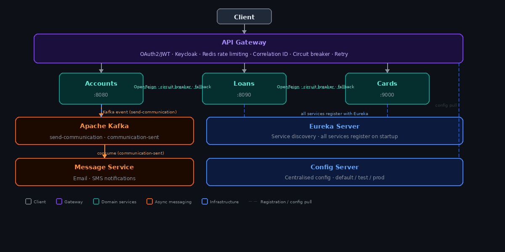

# G M Mani

**Backend Engineer · Java · Spring Boot · Microservices**

*Building distributed systems that don't fall over.*

---

## About me

Software Engineer at Tata Consultancy Services, Bengaluru. I work in the backend — Java, Spring Boot, distributed systems. Most of what I build lives in the microservices and event-driven space: service discovery, async messaging, API gateway patterns, security pipelines, and making sure things stay up when something breaks.

The projects here are things I built to go past the basics — real patterns from real systems.

---

## Tech stack

**Core**
`Java 21` · `Spring Boot 4` · `Spring Cloud` · `Spring Security 6`

**Microservices & Messaging**
`Eureka` · `Spring Cloud Config` · `OpenFeign` · `Apache Kafka` · `Spring Cloud Stream` · `Avro` · `Schema Registry`

**Resilience**
`Resilience4j` · `Circuit Breaker` · `Retry` · `Rate Limiter` · `DLT` · `Idempotent Consumer`

**API & Security**
`Spring Cloud Gateway` · `OAuth2 / JWT` · `Keycloak` · `RBAC` · `REST APIs`

**Data & Persistence**
`Spring Data JPA` · `Hibernate` · `PostgreSQL` · `H2` · `Redis`

**DevOps & Tooling**
`Docker` · `Docker Compose` · `JIB` · `Maven` · `Git`

---

## Projects

### [Microservices — Banking Backend System](https://github.com/gm-mani/Microservices)

7 Spring Boot services wired together as a production-style banking backend.

**Services:** `accounts` · `loans` · `cards` · `API gateway` · `Eureka` · `Config Server` · `Message Service`

**Key patterns implemented:**
- Gateway handles OAuth2/JWT (Keycloak), Redis rate limiting, correlation ID propagation, and circuit breaker fallbacks — per route
- Services talk via OpenFeign with Resilience4j circuit breakers and fallback handlers
- Account creation publishes to Kafka (`send-communication`); message service consumes async for email/SMS — zero coupling between services
- Config Server manages environment-specific profiles (default / test / prod) for all services
- Full Docker Compose setup across three environments; JIB for containerisation

`Spring Boot 4` · `Java 21` · `Kafka` · `Resilience4j` · `Spring Cloud Gateway` · `Keycloak` · `Redis` · `Docker Compose` · `JIB`

---

### [Kafka Order Processing System](https://github.com/gm-mani/kafka-order-processing-system)

A producer/consumer system that implements the Kafka patterns that matter in production — not just publish and subscribe.

**What's implemented:**
- **Outbox Pattern** — order and outbox event written in a single `@Transactional` block; a `@Scheduled` publisher polls and sends to Kafka, guaranteeing no lost events even if Kafka is temporarily down
- **Avro serialisation + Confluent Schema Registry** — strongly typed event contracts between producer and consumer
- **Retry topics + Dead Letter Topic** — failed messages flow through `retry-1 (1s)` → `retry-2 (2s)` → `DLT`; poison messages are parked for investigation
- **Idempotent consumer** — deduplication via `processed_orders` table; duplicate deliveries are safely ignored
- **Manual offset acknowledgment** — offsets committed only after successful processing
- Consumer group rebalancing, message keys for ordering guarantees, Kafka UI for monitoring

`Spring Boot 4` · `Apache Kafka` · `Avro` · `Schema Registry` · `Outbox Pattern` · `DLT` · `PostgreSQL` · `Docker Compose`

---

## Currently working on

- Kubernetes — migrating the microservices system from Docker Compose to K8s (config maps, health probes, resource limits)
- Distributed tracing with Micrometer + Zipkin
- Refresh token flow and method-level security in the Spring Security project

---

## Get in touch

**LinkedIn:** [linkedin.com/in/mani12](http://www.linkedin.com/in/mani12)
**GitHub:** [github.com/gm-mani](https://github.com/gm-mani)

---

Based in Bengaluru, India · Open to opportunities

